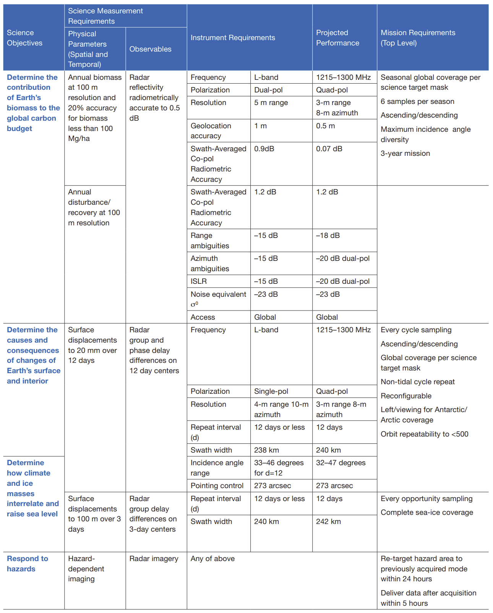

    # Tables

This is a collection of tables from the NISAR Mission Science Users' Handbook that are replicated here for quick reference. 

## NISAR Instrument and Mission Requirements

:::{table} NISAR Science Traceability Matrix. Table 3-3 from the NISAR Mission Science Users' Handbook (@nisarMissionHandbook2025, p. 26), indicating the instrument and mission requirements.
:label: tbl:science-traceability-matrix-table

