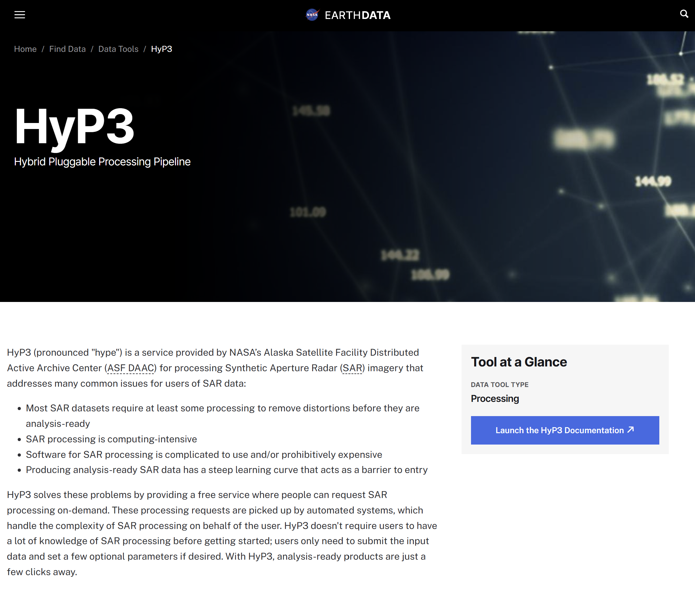

# Tools and Services Overview

## Earthdata Tools and Services

ASF is working in collaboration with other development teams across the Earthdata ecosystem to make NISAR data available using existing Earthdata tools and platforms, including:

- [Worldview](#ed-worldview)
- [NASA Harmony](#ed-harmony)
- [Earthdata GIS (EGIS)](#ed-egis)
- [HyP3](#ed-hyp3)

Refer to the @tools-services-roadmap to check the status of these development efforts.

(ed-worldview)=
### Worldview

NASA's [Worldview](https://www.earthdata.nasa.gov/data/tools/worldview) is a powerful visualization platform, allowing users to browse hundreds of different NASA datasets. Users can view the extent of available acquisitions through time, compare different datasets or acquisition dates, and generate time series animations. 

:::{important}NISAR GCOV Layers Available in Worldview!

NISAR [PROVISIONAL](#nisar-provisional-data-july) [Geocoded Polarimetric Covariance (GCOV)](#gcov-product-overview) layers are now available to explore on [Worldview](https://worldview.earthdata.nasa.gov/)!

[Learn more about the layers and how to leverage visualization tools in Worldview.](#worldview-overview)
:::

(ed-harmony)=
### NASA Harmony

NASA's [Harmony](https://www.earthdata.nasa.gov/data/tools/nasa-harmony) service allows users to transform NASA datasets, customizing the output to better meet their needs. 

For NISAR products, Harmony services are being developed to support subsetting a NISAR HDF5 by [dataset](#h5-datasets) or geographic range, with the option for some output products to be generated in a different file format or projection.

(ed-egis)=
### Earthdata GIS

NASA's [Earthdata GIS (EGIS)](https://www.earthdata.nasa.gov/data/tools/earthdata-gis) platform provides content that can be leveraged interactively in web maps or applications and GIS software platforms. ArcGIS Image Services allow users to interact with source rasters without having to download the data first, but the NISAR data format makes it challenging to leverage image services without first transforming the source rasters. 

ASF is working with Esri and the EGIS team to explore potential methods of service publication that minimize storage while still providing a performant user experience.

(ed-hyp3)=
### HyP3

ASF's [Hybrid Pluggable Processing Pipeline (HyP3)](https://hyp3-docs.asf.alaska.edu/) is a cloud-native processing platform designed to efficiently generate analysis-ready data products on demand in response to user requests. Originally designed to apply complex scientific workflows to Sentinel-1 SAR data, the platform can be used for any on-demand processing workflow that benefits from leveraging cloud computing to output higher-level products. 

ASF is planning to support on-demand generation of NISAR products using HyP3. Development effort is already underway in collaboration with the [VolcSARvatory](https://www.uaf.edu/news/alaska-developed-volcano-monitoring-system-will-expand-across-us.php) project for generating [GUNW](#gunw-product-overview) products using custom date pairs, along with an [Earth Action](https://appliedsciences.nasa.gov/) project supporting on-demand processing of Level 3 products from select [NISAR Science Algorithms](https://gitlab.com/nisar-science-algorithms). 

