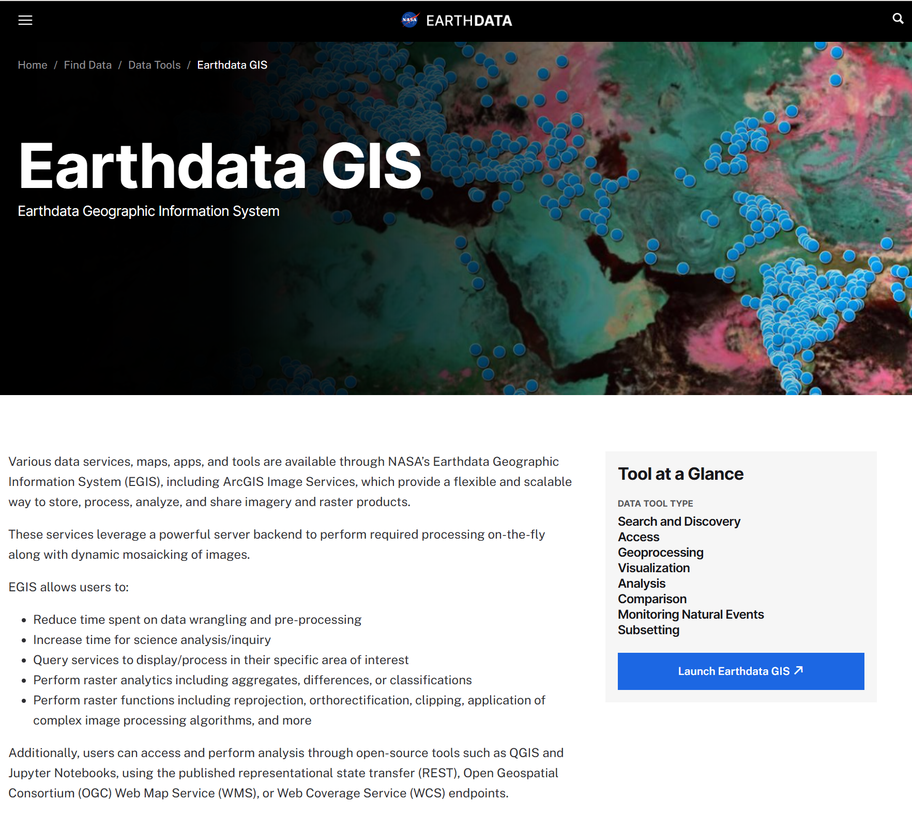

# Tools and Services Overview

## Earthdata Tools and Services

ASF is working in collaboration with other development teams across the Earthdata ecosystem to make NISAR data available using existing Earthdata tools and platforms, including:

- [NASA Harmony](#ed-harmony)
- [Worldview](#ed-worldview)
- [Earthdata GIS (EGIS)](#ed-egis)

Refer to the @tools-services-roadmap to check the status of these development efforts.

(ed-harmony)=
### [NASA Harmony](https://www.earthdata.nasa.gov/data/tools/nasa-harmony)

Intro text about NISAR and Harmony

(ed-worldview)=
### [Worldview](https://www.earthdata.nasa.gov/data/tools/worldview)

Intro text about NISAR in Worldview and GIBS

(ed-egis)=
### [Earthdata GIS](https://www.earthdata.nasa.gov/data/tools/earthdata-gis)

Intro text about NISAR services in EGIS (and potential difficulties with NISAR services)

