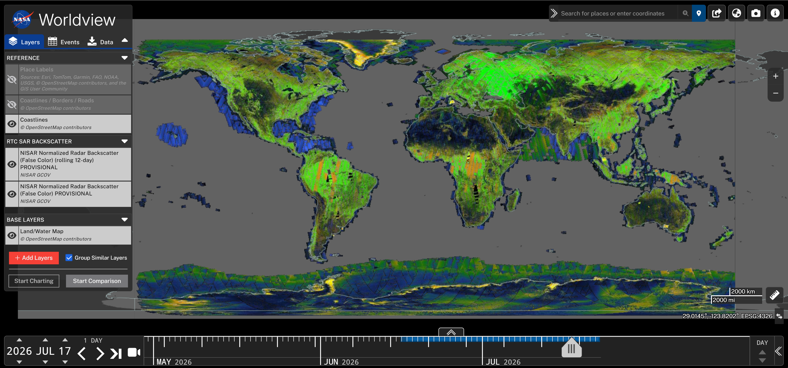

# Exploring NISAR Data in Worldview

(worldview-overview)=
## Worldview
[NASA Worldview](https://worldview.earthdata.nasa.gov/) is a user-friendly visualization tool that enables interactive browsing and animation of over 1,200 satellite data products. Imagery in Worldviews is powered by NASA's [Global Imagery Browse Services (GIBS)](https://www.earthdata.nasa.gov/engage/open-data-services-software/earthdata-developer-portal/gibs-api) service and delivers  global, full-resolution visualizations of satellite imagery.

:::{important}NISAR GCOV Layers Available in Worldview
NISAR [Level-2 Geocoded Covariance (GCOV)](#gcov-product-overview) data can now be [visualized in Worldview](#worldview-nisar-gcov)! 

<a href="https://worldview.earthdata.nasa.gov/?v=-283.0791525473933,-136.9755200581828,233.8728850905137,117.46181096672454&l=Reference_Labels_15m(hidden),Reference_Features_15m(hidden),Coastlines_15m,NISAR_L2_Geocoded_Polarimetric_Covariance_12Day,NISAR_L2_Geocoded_Polarimetric_Covariance,Land_Water_Map(opacity=0.77)&lg=true&t=2026-07-17-T13%3A26%3A54Z">

</a>

Layers are available for [1-day](#worldview-daily-mosaics) or [12-day](#worldview-12-day-mosaics) mosaics. 
 :::

(worldview-nisar-gcov)=
## NISAR GCOV Layers

{button}`View NISAR GCOV Layers in Worldview <https://worldview.earthdata.nasa.gov/?v=-283.0791525473933,-136.9755200581828,233.8728850905137,117.46181096672454&l=Reference_Labels_15m(hidden),Reference_Features_15m(hidden),Coastlines_15m,NISAR_L2_Geocoded_Polarimetric_Covariance_12Day,NISAR_L2_Geocoded_Polarimetric_Covariance,Land_Water_Map(opacity=0.77)&lg=true&t=2026-07-17-T13%3A26%3A54Z>`

NISAR GCOV layers in Worldview are displayed as mosaics of [PROVISIONAL GCOV](#nisar-provisional-data-july) products using a false-color [RGB decomposition](#worldview-rgb-decomp) to facilitate more intuitive visual interpretation of SAR backscatter data. The mosaics are posted to a [pixel spacing](#worldview-pixel-spacing) of 15.5 meters. 

The layers include all GCOV acquisitions, regardless of the acquisition mode, with the best available product for any given area displayed. This approach prioritizes [Frequency A](#nisar-frequencies) acquisitions and acquisitions with the most available [polarimetric channels](#nisar-polarization). <!-- TODO: The current mosaics do not enforce a display order, so overlapping areas can be a patchwork of components from the overlapping images. The Worldview team is aware, and may implement a fix at some point. If so, add in this documentation: For areas with both ascending and descending acquisitions available for the same day, the most recent image will be displayed.-->

There are two different NISAR GCOV layers available in Worldview: [daily mosaics](#worldview-daily-mosaics) and [12-day mosaics](#worldview-12-day-mosaics).

(worldview-daily-mosaics)=
#### Daily Mosaics

NISAR PROVISIONAL GCOV products are displayed as a daily mosaic, and users can use the [time slider](#worldview-time-slider) to click through each day to view a mosaic of the GCOV products acquired on that date. 

(worldview-12-day-mosaics)=
#### Rolling 12-Day Mosaics

This rolling 12-day layer loads the past twelve days of images, with the latest date displayed on top. The NISAR mission has a 12-day repeat cycle, so each of these 12-day mosaics should provide global coverage. 

Users can click through the layer day by day, or use the `Custom Interval Selector` option to set a [custom interval](#wv-ts-custom-interval) of 12 days to quickly cycle through global mosaics.

(worldview-rgb-decomp)=
### RGB Decomposition

All GCOV products are included in a single visualization layer, even if they are collected using different modes or frequencies. 

Quad-pol products, which contain all four available polarimetric channels (HH, HV, VH, VV), are colorized using the same approach as [dual-pol](#rgb-dual-pol) products (containing HH and HV or VV and VH) to make the mosaic appear more consistent. 

The [single-pol](#rgb-single-pol) products require a different colorization approach, as they lack multiple polarimetric channels to decompose. The color bar configured for use with single-pol data was designed to mimic the dual-pol colors to the extent possible, but you will notice different color characteristics between images processed using the [dual-pol approach](#rgb-dual-pol) and the [single-pol approach](#rgb-single-pol). 

Refer to @worldview-colorbars-image for a comparison of the color bars for the dual-pol and single-pol RGB decomposition approaches. 

```{figure} ../assets/worldview-colorbars.png
:label: worldview-colorbars-image
:alt: Comparison of multipolarimetric and single-polarization color bars used in Worldview.  
:align: center

Color bars used in dual-polarization (top) and single-polarization (bottom) imagery visualization for NISAR GCOV products in Worldview. 
```

Note that different land cover types may appear similar to each other in this visualization. Comparing this visualization with other imagery in Worldview may help when interpreting NISAR GCOV data.  

(rgb-dual-pol)=
#### Dual-pol Approach

For GCOV products containing multiple polarimetric channels (dual-pol or quad-pol), the visualization combines co-polarized backscatter (HH or VV) values in the red and blue channels with cross-polarized values (HV or VH) in the green channel. 

In this false-color scale, vegetated areas appear green; urban and/or sparsely vegetated areas appear orange or yellow; calm water, dry sand, and frozen ground all appear blue; and rough water may appear red.

(rgb-single-pol)=
#### Single-pol Approach

Single-polarization acquisitions, collected mostly in polar regions or over open ocean, are also colorized. Because they only have one available polarization, there is less information to integrate into the false-color visualization. The [color bar](#worldview-colorbars-image) passes from blue to green to orange to yellow, indicating co-polarized backscatter values from low to high. 

Calm water or dry soil is still generally blue, and urban areas are still generally yellow, but vegetated areas may exhibit a different color of green/orange than in the dual-pol RGB decomposition for the same area. Wet snow may appear very yellow, while drier snow is more green or blue. Sea ice can exhibit colors similar to features on land, especially when surface melt increases the amount of backscatter.

(worldview-pixel-spacing)=
### Pixel Spacing

Where multiple frequencies are available, the higher-resolution frequency is included in the visualization (generally [Frequency A](#nisar-frequencies)). Over land, most GCOV Frequency A datasets have a pixel spacing of 10 or 20 meters, while Frequency B datasets have a pixel spacing of 80 meters. Regardless of the [pixel spacing of the source GCOV dataset]((#gcov-pixel-spacing)), however, all products are resampled to 15.5-m pixel spacing in the visualization layer.

Because the pixel spacing of the visualization is very close to the pixel spacing of the Frequency A products, it generally gives a very good indication of the level of detail represented in the source rasters. Take a look at example products zoomed to the full resolution of the imagery for areas with source rasters posted to [10-m](#worldview-full-zoom-10-image), [20-m](#worldview-full-zoom-20-image), and [80-m](#worldview-full-zoom-80-image) pixel spacing. 

```{figure} ../assets/worldview-full-zoom-10m.png
:label: worldview-full-zoom-10-image
:alt: Image of GCOV layer from 10-m source raster zoomed to view full 15.5-m pixel spacing.
:align: center

The GCOV layer is zoomed to the point where users can see the full 15.5-m pixel spacing of the imagery in an area where the source GCOV rasters have 10-m pixel spacing.
```

```{figure} ../assets/worldview-full-zoom-20m.png
:label: worldview-full-zoom-20-image
:alt: Image of GCOV layer from 20-m source raster zoomed to view full 15.5-m pixel spacing.
:align: center

The GCOV layer is zoomed to the point where users can see the full 15.5-m pixel spacing of the imagery in an area where the source GCOV rasters have 20-m pixel spacing.
```

```{figure} ../assets/worldview-full-zoom-80m.png
:label: worldview-full-zoom-80-image
:alt: Comparison of 10-m and 80-m source rasters in the visualization
:align: center

The GCOV layer is zoomed to the point where users can see the full 15.5-m pixel spacing of the imagery in an area with different acquisition modes collected on different dates. The image on the left shows the visualization when the source raster is a dual-pol image with 10-m pixel spacing, and the image on the right shows the visualization when the source raster is a single-pol image with 80-m pixel spacing.
```

## Using NISAR Data in Worldview

### Adding NISAR Data 

1. Click on the **Add Layers** in the Layers tab to open a window providing access to all available datasets and type **NISAR** into the search bar to return a list of available layers associated with the NISAR mission (@worldview-add-layers-image).

```{figure} ../assets/worldview-add-layers.png
:label: worldview-add-layers-image
:alt: Screenshot highlighting the **Add Layers** button and the search bar. 
:align: center

Click the `Add Layers` button and enter `NISAR` in the search bar to find available NISAR layers and add them to Worldview.
```

_While Worldview allows users to change the display to a polar view (Arctic or Antarctic) instead of the default Geographic view (WGS84 coordinate system), note that you will not be able to search for or display NISAR layers when a polar view setting has been applied._

2. Click on the data type you want to add. You can either select the checkbox next to the data layer(s) in the results panel or click the **Add Layer** button in the layer explanation panel (@worldview-add-nisar-layer-image).

    - NISAR GCOV layers are listed under the `RTC SAR Backscatter` category
    - NISAR GCOV layers are named `NISAR Normalized Radar Backscatter`
    - There are separate layers available for [daily mosaics](#worldview-daily-mosaics) and [12-day mosaics](#worldview-12-day-mosaics)
   
3. Click the **X** on the top right of the pop-up to close the search window and view the layers.

```{figure} ../assets/worldview-add-nisar-layer.png
:label: worldview-add-nisar-layer-image
:alt: Screenshot displaying the Add Layer button and checkbox.
:align: center

Add layers to the map using either the **Add Layer** button or by clicking the checkbox next to the desired data layer. 
```

#### Organizing Layers

- You can click the checkbox next to **Group Similar Layers** to help organize data layers, which can be helpful if comparing multiple data types.

- Above the newly added data in the layer panel, you can toggle on/off **Place Labels**, **Coastlines/Borders/Roads** and **Coastlines** layers to help locate and orient yourself while exploring data (@worldview-layers-panel-image). 

    ```{figure} ../assets/worldview-layers-panel.png
    :label: worldview-layers-panel-image
    :alt: Screenshot describing the layer panel options. 
    :align: center
    
    The layers panel allows for toggling on and off of each layer. This can be done by clicking on the eye icon. In this screenshot, all the reference layers are on, displaying place labels, borders, and coastlines. On the bottom of the panel, the **Group Similar Layers** checkbox is checked, which helps organize data layers. This can be helpful when comparing across multiple data types. 
    ```

- You can select a base layer from the **Base Layers** menu if desired. Layers available by default include [Moderate Resolution Imaging Spectroradiometer (MODIS)](https://www.earthdata.nasa.gov/data/instruments/modis), [Visible Infrared Imaging Radiometer Suite (VIIRS)](https://www.earthdata.nasa.gov/data/instruments/viirs), and [Ocean Color Instrument (OCI)](https://www.earthdata.nasa.gov/data/instruments/oci) imagery.
    - Learn more about base layer options in this [Earthdata Forum post](https://forum.earthdata.nasa.gov/viewtopic.php?t=5228).

### Exploring NISAR Data

(worldview-time-slider)=
#### Time Slider Tool

Once NISAR data are loaded into Worldview, search for available data temporally by using the time slider tool. As a default, an arrow click steps through time one day at a time. This can be useful when determining when there are data acquisitions over an area of interest. 

(wv-ts-custom-interval)=
##### Custom Interval

You can customize the time slider tool to step through time using a custom increment. Click the **1 Day** text above the time slider arrows, and select **Custom** from the pop-up menu (@worldview-customize-timestep-image). 

By adjusting the Custom Interval Selector to 12 days, you can explore data acquired each cycle. This allows you to quickly cycle through acquisitions with the same viewing geometry over time for an area of interest. 

```{figure} ../assets/worldview-customize-timestep.png
:label: worldview-customize-timestep-image
:alt: Screenshot illustrating adjusting the Custom Interval Selector to 12 Days. 
:align: center

Click on the the **1 Day** text above the time step arrows, then select **Custom** from the pop-up menu. Enter 12 days into the Custom Interval Selector to step through time 12 days/one NISAR cycle at a time. 
```

(wv-ts-animation)=
##### Animation

To create an animation from available imagery, click the video recorder icon to the right of the arrows (@worldview-animate-timeseries-image). 

- Like the time slider tool, the animation tool allows for a custom increment of 12 days for stepping through each NISAR cycle if desired. 
- Select a start date, end date, and how many frames pers second will be shown in the final animation. 

```{figure} ../assets/worldview-animate-timeseries.png
:label: worldview-animate-timeseries-image
:alt: Screenshot showing the placement and parameters in the animation tool.
:align: center

Click on the video recorder icon next to the time step arrows to animate a timeseries. A pop-up box will allow for further refinement of the time step, start and end date, and frames per second in the animation. Click on the video recorder icon circled in red to create the animated GIF. 
```

- Click on the video recorder icon in the settings window (#worldview-animate-timeseries-image), which will open a pop-up to further refine the area of interest to be shown in the final animation. Here, you can select the resolution of the output GIF. 
- Click the **Create GIF** button to create the GIF and save locally (@worldview-save-animation-gif-image). 

```{figure} ../assets/worldview-save-animation-gif.png
:label: worldview-save-animation-gif-image
:alt: Screenshot describing how to put finishing touches on animation and save. 
:align: center

Adjust the rectangle over an area of interest to be animated. Select the output resolution for the final GIF and check the box next to **Include Date Stamps** to include date stamps on the final product. Finally, click **Create GIF** to create and save the animation. 
```

#### Comparison Tool

Data can be compared across dates and datasets by using the clicking the **Start Comparison** button (@worldview-start-comparison-image). By default, a swipe bar will appear on the screen, allowing users to swipe between two different tabs of data. 

```{figure} ../assets/worldview-start-comparison.png
:label: worldview-start-comparison-image
:alt: Screenshot highlighting the Start Comparison button. 
:align: center

Select the **Start Comparison** button to enter comparison mode. 
```

Adjust the dates to compare by moving the **A** and **B** arrows on the time slider or by clicking into the **A** and **B** tabs in the **Layers** panel (@worldview-adjust-comparison-image). Within each comparison tab, you can toggle layers on and off, which can be particularly useful when comparing across datasets.
 
```{figure} ../assets/worldview-adjust-comparison.png
:label: worldview-adjust-comparison-image
:alt: Screenshot highlighting the tabs and time slider arrows to adjust dates in comparison mode. 
:align: center

Adjust the date of the comparison sides by moving the time slider arrows of **A** or **B**, circled in red, or by clicking into the **A** or **B** tabs highlighted on the Layers panel. 
```

Besides the [**Swipe**](@worldview-adjust-comparison-image) setting for the Comparison tool, there are also options for [**Opacity**](@worldview-compare-opacity-image) or [**Spy**](@worldview-compare-spy-image) settings. 

- The **Opacity** option (@worldview-compare-opacity-image) overlays the two dates, and allows you to adjust the relative transparency of the two layers.  

    ```{figure} ../assets/worldview-compare-opacity.png
    :label: worldview-compare-opacity-image
    :alt: Screenshot highlighting the opacity option in the comparison tool. 
    :align: center
    
    Use the **Opacity** setting of the Comparison tool to set the relative transparency of the two layers. 
    ```

- The **Spy** option (@worldview-compare-spy-image) allows you to peek through one layer to see the other layer using a movable viewing window.

    ```{figure} ../assets/worldview-compare-spy.png
    :label: worldview-compare-spy-image
    :alt: Screenshot highlighting the spy option in the comparison tool. 
    :align: center
    
    Use the **Spy** setting of the Comparison tool to peek through one layer into the other using a movable viewing window. 
    ```

You cannot animate or download data while in comparison mode. Click the **Exit Comparison** button on the bottom of the **Layers** panel to leave the comparison mode.

```{figure} ../assets/worldview-exit-comparison.png
:label: worldview-exit-comparison-image
:alt: Screenshot emphasizing the **Exit Comparison** button.  
:align: center

Exit Comparison mode by clicking the **Exit Comparison** button on the bottom of the **Layers** panel. 
```

## Downloading Data

Worldview makes it easy to launch a search for the source data products that were used to create a visualization. If you find a date with good imagery for your area of interest, you can use the **Data** tab to launch [Earthdata Search](#earthdata-search-overview) directly from the Worldview interface. 

This functionality pre-populates your search criteria with the collection of products used to create the visualization (in this case, [NISAR PROVISIONAL GCOV](https://search.earthdata.nasa.gov/search/granules/collection-details?p=C2854338529-ASF) products), the date you've selected in the time slider, and (optionally) an area of interest.

### Launch Earthdata Search from Worldview

As illustrated in @worldview-download-data-image:

1. Navigate to your area of interest in the map and select a date that has imagery of interest. 
2. Click the **Data** tab in the Worldview pane.
3. Select the layer you want to use for your data search by clicking the radio button.
   - You can only search for source data for one layer at a time.
4. If desired, click the **Set Area of Interest** checkbox, which will allow you to draw a rectangular AOI to pass to Earthdata Search as a spatial extent filter.
5. Click the **Download Via Earthdata Search** button to launch Earthdata Search, which will be pre-populated with your search criteria.

```{figure} ../assets/worldview-download-data.png
:label: worldview-download-data-image
:alt: Screenshot displaying the Data download parameters.  
:align: center

Download data by clicking the **Data** tab on the **Layers** panel. Select the data layer you want to access source data for, click the checkmark to set an area of interest (optional), and click **Download Via Earthdata Search**. This will open Earthdata Search with all the selected parameters pre-populated. 
```

(worldview-wms-layers)=
## Worldview WMS Layers

NASA Worldview uses the [Global Imagery Browse Services (GIBS)](https://earthdata.nasa.gov/gibs) to rapidly retrieve its imagery for an interactive browsing experience. While NASA Worldview uses OpenLayers as its mapping library, GIBS imagery, including the NISAR GCOV layer, can also be accessed directly using GIS software, [NASA WorldWind](https://worldwind.arc.nasa.gov/), web maps, and other geospatial applications.

To add any layer served by the GIBS WMS to an application, connect to  https://gibs.earthdata.nasa.gov/wms/epsg3857/best/wms.cgi  through the application, and select the desired layer to add. Refer to the [GIBS Wiki Page]( https://wiki.earthdata.nasa.gov/display/GIBS/) for more information. <!-- TODO: check to make sure that this is accessible to the public; it's behind EDL, but maybe anyone with an EDL can access it. -->

### NISAR GCOV WMS in QGIS

To add a GIBS WMS layer to QGIS, select **Add Layer**, then set the data type to WMS/WMTS. Click the New button (@worldview-add-new-wms-image). 

```{figure} ../assets/worldview-add-new-wms.png
:label: worldview-add-new-wms-image
:alt: Screenshot of a QGIS window ready to load the GIBS WMS service.   
:align: center

Add a new data layer to your GIS with the data type WMS/WMTS. 
```

Enter a name for the connection, and enter the following URL into the **URL** field (@worldview-add-wms-connection-image):  
`https://uat.gibs.earthdata.nasa.gov/wms/epsg4326/best/wms.cgi`  

Click OK to add the WMS server connection to your project. This will provide access to all available GIBS imagery layers served using the EPSG 4326 coordinate system (which includes the NISAR layers).

```{figure} ../assets/worldview-add-wms-connection.png
:label: worldview-add-wms-connection-image
:alt: Screenshot of a QGIS window ready to load the GIBS WMS service.   
:align: center

Enter `https://uat.gibs.earthdata.nasa.gov/wms/epsg4326/best/wms.cgi` into the **URL** field for the WMS/WMTS connection and press OK to add the WMS connection to your project. 
```

Select the newly added connection from the dropdown menu and click the **Connect** button to list the layers. Either search for the desired layer by typing NISAR into the search bar or expand the RTC SAR Backscatter category to find and select the NISAR GCOV layers. 

```{figure} ../assets/worldview-qgis-add-nisar-wms.png
:label: worldview-qgis-add-nisar-wms-image
:alt: Screenshot of a QGIS window ready to add the NISAR WMS layer.   
:align: center

Select the newly added connection in the dropdown menu and press **Connect**. Scroll down and expand the RTC SAR Backscatter category. Then, select the NISAR GCOV layer and press **Add**. 
```

Since this data collection is temporally dependent, you will need to use the Temporal Controller tool in QGIS to explore the data through time.

```{figure} ../assets/worldview-qgis-temporalcontroller.png
:label: worldview-qgis-temporal-controller-image
:alt: Screenshot highlighting the Temporal Controller tool in QGIS that allows NISAR data to be shown.   
:align: center

Select the clock icon to open the Temporal Controller tool in QGIS. Adjust the dates in the animation range to your desired time period to expose NISAR data. 
```

### NISAR GCOV WMS in ArcGIS Pro

To add the GIBS WMS Server to ArcGIS Pro, click the **Connections** button in the **Insert** menu, then click **Server** in the drop-down menu and select **New WMS Server** (@gibs-arcgispro-server-connection-image). 

```{figure} ../assets/gibs-arcgispro-server-connection.png
:label: gibs-arcgispro-server-connection-image
:alt: Screenshot of adding a new WMS server in ArcGIS Pro
:align: center

To add a GIBS WMS Server to ArcGIS Pro, click the **Connections** button in the **Insert** menu, then click **Server** in the drop-down menu and select **New WMS Server**.
```

Enter the following URL into the **Server URL** field (@gibs-arcgispro-server-gibs-url-image):  
`https://uat.gibs.earthdata.nasa.gov/wms/epsg4326/best/wms.cgi`  

Leave the default settings for all other fields (including blank fields).

```{figure} ../assets/gibs-arcgispro-server-gibs-url.png
:label: gibs-arcgispro-server-gibs-url-image
:alt: Screenshot of entering the URL for the GIBS WMS to an ArcGIS Pro Server Connection setup
:align: center

Enter the URL for the GIBS WMS to the **Server URL** field in the **Add WMS Server Connection** window in ArcGIS Pro.
```

Expand the GIBS item in the Servers Section of the Catalog pane, expand the RTC SAR Backscatter entry, and drag the NISAR_L2_Geocoded_Polarimetric_Covariance service into the map to add it as a map layer (@gibs-arcgispro-add-service-image). 

```{figure} ../assets/gibs-arcgispro-add-service.png
:label: gibs-arcgispro-add-service-image
:alt: Screenshot of finding and adding the NISAR GCOV service to an ArcGIS Pro map
:align: center

Navigate to the NISAR GCOV layer in the list of GIBS WMS services, and drag it onto the map to add the service as a layer.
```

Select the WMS layer in the Contents pane, and click the **Time** menu to adjust the time slider settings (@gibs-arcgispro-time-slider-image). You might want to set a custom date range and adjust the interval between time slider steps.

```{figure} ../assets/gibs-arcgispro-time-slider.png
:label: gibs-arcgispro-time-slider-image
:alt: Screenshot of adjusting time slider settings. 
:align: center

Use the **Time** menu to adjust the time slider settings as desired. 
```

%### NISAR GCOV WMS in ArcGIS Web Maps

<!-- TODO: Add content. Reference https://storymaps.arcgis.com/stories/dc2807b444924fc3a76c117a2c909f8b#ref-n-rWzJMt -->

%### NISAR GCOV WMS in Google Earth Pro

<!-- TODO: Add content. It looks like WMS services are not supported in the Google Earth browser interface, only the desktop Google Earth Pro, which makes it a somewhat less compelling use case.-->